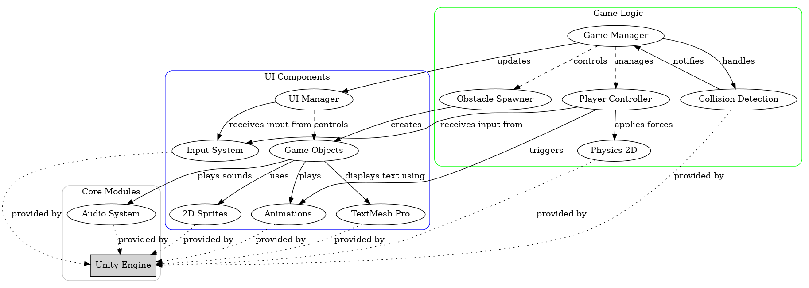

# Flappy-bird-game

Flappy Bird game

This is an Android game made in Unity Game Engine.

This game is made in Unity Game Engine Version: Unity 2020.3.25f1 Personal <DX11>

This is just a practice project. More changes will be made with later updates.

This game assets are not made by me.
I will make sure to link the original author of the assets once I find them.

## Features

- Simple and intuitive gameplay
- Responsive controls
- Score tracking
- Game over screen
- Restart functionality

## Unique Feature

- Chages the Background of the game and music depending on the time of the Day

## Flowchart

## Output

### Day

<table>
<tr>
<td>
</td><td> </td> <td>
</td> 
</tr></table>

### Night

<table>
<tr>
<td>
</td><td> </td> <td>
</td> 
</tr></table>

